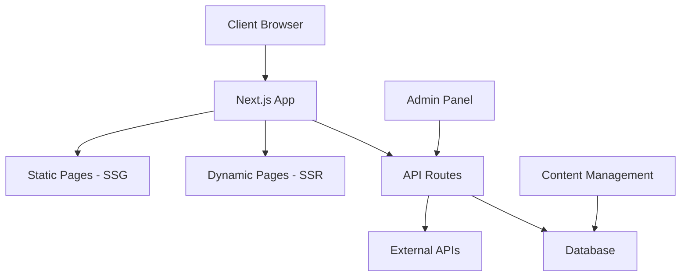
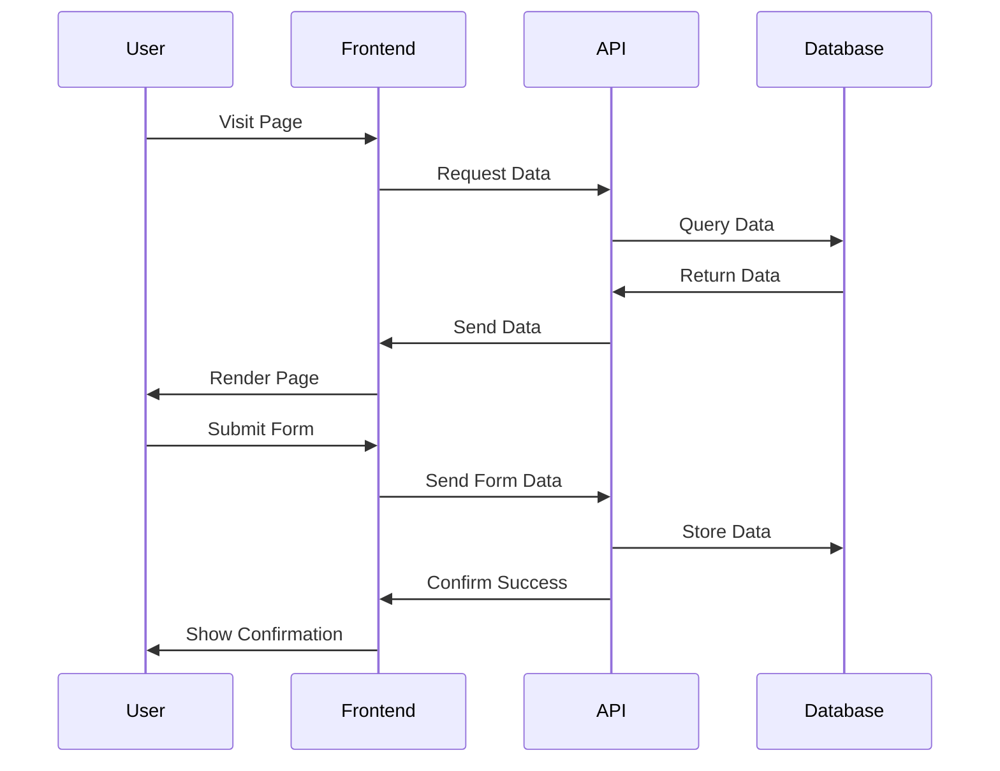

# Design Document

## Overview

Bu tasarım dokümanı, SaaS portfolio web sitesinin kapsamlı bir şekilde yenilenmesi ve geliştirilmesi için teknik ve görsel tasarım detaylarını içermektedir. Doküman, modern web standartları, en iyi UX/UI pratikleri ve güncel teknolojiler kullanılarak etkileyici bir portfolio deneyimi oluşturmak için gereken tüm bileşenleri tanımlar.

## Architecture

### Genel Mimari

Portfolio web sitesi, aşağıdaki mimari prensiplere göre tasarlanacaktır:

1. **Next.js App Router** - Performans ve SEO optimizasyonu için Server Components kullanımı
2. **Hybrid Rendering** - Statik sayfalar için SSG, dinamik içerik için SSR kullanımı
3. **Component-Based Architecture** - Yeniden kullanılabilir ve modüler bileşenler
4. **Responsive Design** - Mobile-first yaklaşımı ile tüm cihazlarda optimal deneyim
5. **Progressive Enhancement** - Temel işlevsellik garanti edilirken gelişmiş özelliklerin kademeli olarak sunulması



### Veri Akışı



## Components and Interfaces

### Core Components

1. **Layout Components**
   - `RootLayout`: Temel sayfa yapısı, meta veriler, global state
   - `Header`: Navigasyon ve branding
   - `Footer`: İletişim bilgileri, sosyal medya, copyright
   - `Container`: İçerik konteynerleri için standart yapı

2. **UI Components**
   - `Button`: Farklı varyasyonlarda (primary, secondary, outline, text)
   - `Card`: Projeler, hizmetler ve blog yazıları için
   - `Badge`: Etiketler ve kategoriler için
   - `Avatar`: Profil ve testimonial görselleri için
   - `Tooltip`: Ek bilgiler için
   - `Modal`: Detaylı içerik ve formlar için

3. **Section Components**
   - `Hero`: Etkileyici giriş bölümü, animasyonlu başlık ve CTA
   - `About`: Kişisel bilgiler, yetenekler ve deneyim
   - `Services`: Sunulan hizmetlerin detaylı açıklamaları
   - `Portfolio`: Filtrelenebilir proje galerisi
   - `Testimonials`: Müşteri yorumları ve referanslar
   - `Blog`: En son yazılar ve kategoriler
   - `Contact`: İletişim formu ve bilgileri

4. **Functional Components**
   - `Form`: Validasyon ve submission işlemleri
   - `Filter`: Portfolio ve blog için filtreleme
   - `Search`: İçerik arama
   - `Pagination`: Sayfalama
   - `Newsletter`: Abonelik formu

### Admin Interface

Admin paneli aşağıdaki bileşenleri içerecektir:

1. **Authentication**
   - Login/Logout
   - Password Reset
   - Session Management

2. **Dashboard**
   - Analytics Overview
   - Recent Activities
   - Quick Actions

3. **Content Management**
   - Projects CRUD
   - Blog Posts CRUD
   - Services CRUD
   - Testimonials CRUD

4. **Settings**
   - Profile Settings
   - Site Configuration
   - SEO Settings

## Data Models

### Project Model

```typescript
interface Project {
  id: string;
  title: string;
  slug: string;
  description: string;
  longDescription: string;
  thumbnailUrl: string;
  images: string[];
  technologies: string[];
  category: string[];
  liveUrl?: string;
  githubUrl?: string;
  featured: boolean;
  completionDate: Date;
  createdAt: Date;
  updatedAt: Date;
}
```

### Blog Post Model

```typescript
interface BlogPost {
  id: string;
  title: string;
  slug: string;
  excerpt: string;
  content: string;
  coverImage: string;
  author: {
    name: string;
    avatar: string;
  };
  tags: string[];
  category: string;
  publishedAt: Date;
  createdAt: Date;
  updatedAt: Date;
}
```

### Service Model

```typescript
interface Service {
  id: string;
  title: string;
  slug: string;
  description: string;
  icon: string;
  features: string[];
  order: number;
  createdAt: Date;
  updatedAt: Date;
}
```

### Testimonial Model

```typescript
interface Testimonial {
  id: string;
  name: string;
  position: string;
  company: string;
  avatar: string;
  content: string;
  rating: number;
  featured: boolean;
  createdAt: Date;
  updatedAt: Date;
}
```

### Contact Form Model

```typescript
interface ContactForm {
  id: string;
  name: string;
  email: string;
  subject: string;
  message: string;
  status: 'new' | 'read' | 'replied' | 'archived';
  createdAt: Date;
  updatedAt: Date;
}
```

## UI/UX Design

### Renk Paleti

```css
:root {
  /* Ana Renkler */
  --primary-50: #eef2ff;
  --primary-100: #e0e7ff;
  --primary-200: #c7d2fe;
  --primary-300: #a5b4fc;
  --primary-400: #818cf8;
  --primary-500: #6366f1;
  --primary-600: #4f46e5;
  --primary-700: #4338ca;
  --primary-800: #3730a3;
  --primary-900: #312e81;
  --primary-950: #1e1b4b;
  
  /* Nötr Renkler */
  --neutral-50: #fafafa;
  --neutral-100: #f5f5f5;
  --neutral-200: #e5e5e5;
  --neutral-300: #d4d4d4;
  --neutral-400: #a3a3a3;
  --neutral-500: #737373;
  --neutral-600: #525252;
  --neutral-700: #404040;
  --neutral-800: #262626;
  --neutral-900: #171717;
  --neutral-950: #0a0a0a;
  
  /* Accent Renkler */
  --accent-500: #06b6d4;
  --success-500: #10b981;
  --warning-500: #f59e0b;
  --error-500: #ef4444;
}
```

### Tipografi

```css
:root {
  /* Font Ailesi */
  --font-sans: 'Geist', system-ui, -apple-system, BlinkMacSystemFont, 'Segoe UI', Roboto, sans-serif;
  --font-mono: 'Geist Mono', SFMono-Regular, Menlo, Monaco, Consolas, monospace;
  --font-display: 'Geist', system-ui, sans-serif;
  
  /* Font Boyutları */
  --text-xs: 0.75rem;    /* 12px */
  --text-sm: 0.875rem;   /* 14px */
  --text-base: 1rem;     /* 16px */
  --text-lg: 1.125rem;   /* 18px */
  --text-xl: 1.25rem;    /* 20px */
  --text-2xl: 1.5rem;    /* 24px */
  --text-3xl: 1.875rem;  /* 30px */
  --text-4xl: 2.25rem;   /* 36px */
  --text-5xl: 3rem;      /* 48px */
  --text-6xl: 3.75rem;   /* 60px */
  --text-7xl: 4.5rem;    /* 72px */
  --text-8xl: 6rem;      /* 96px */
  --text-9xl: 8rem;      /* 128px */
}
```

### Animasyon ve Geçişler

```css
:root {
  /* Transition Timing */
  --transition-fast: 150ms;
  --transition-normal: 250ms;
  --transition-slow: 350ms;
  --transition-very-slow: 500ms;
  
  /* Easing Functions */
  --ease-in-out: cubic-bezier(0.4, 0, 0.2, 1);
  --ease-in: cubic-bezier(0.4, 0, 1, 1);
  --ease-out: cubic-bezier(0, 0, 0.2, 1);
  --ease-bounce: cubic-bezier(0.34, 1.56, 0.64, 1);
}
```

### Responsive Breakpoints

```css
/* Mobile First Approach */
/* Small (sm) */
@media (min-width: 640px) { /* ... */ }

/* Medium (md) */
@media (min-width: 768px) { /* ... */ }

/* Large (lg) */
@media (min-width: 1024px) { /* ... */ }

/* Extra Large (xl) */
@media (min-width: 1280px) { /* ... */ }

/* 2XL */
@media (min-width: 1536px) { /* ... */ }
```

## Error Handling

### Frontend Error Handling

1. **Form Validation**
   - Client-side validation using Zod schema
   - Real-time feedback with error messages
   - Field-level validation with visual indicators

2. **API Error Handling**
   - Graceful degradation with fallback UI
   - Retry mechanisms for transient failures
   - User-friendly error messages

3. **Global Error Boundary**
   - Capture and log unexpected errors
   - Provide recovery options
   - Maintain user context when possible

### Backend Error Handling

1. **API Response Structure**
   ```typescript
   interface ApiResponse<T> {
     success: boolean;
     data?: T;
     error?: {
       code: string;
       message: string;
       details?: any;
     };
   }
   ```

2. **HTTP Status Codes**
   - 200: Success
   - 400: Bad Request (client error)
   - 401: Unauthorized
   - 403: Forbidden
   - 404: Not Found
   - 500: Internal Server Error

3. **Logging**
   - Error details logged to monitoring system
   - Include request context and stack traces
   - Alert system for critical errors

## Testing Strategy

### Unit Testing

- Component testing with React Testing Library
- Utility function testing with Jest
- API route testing

### Integration Testing

- Page rendering tests
- Form submission flows
- API integration tests

### End-to-End Testing

- Critical user journeys with Playwright
- Cross-browser compatibility testing
- Mobile responsiveness testing

### Performance Testing

- Lighthouse scores monitoring
- Core Web Vitals tracking
- Load time optimization

### Accessibility Testing

- WCAG 2.1 AA compliance
- Screen reader compatibility
- Keyboard navigation testing

## Security Considerations

1. **Authentication & Authorization**
   - Secure authentication flow
   - Role-based access control
   - Session management

2. **Data Protection**
   - Input sanitization
   - XSS prevention
   - CSRF protection

3. **API Security**
   - Rate limiting
   - Request validation
   - Proper error handling

4. **Infrastructure Security**
   - HTTPS enforcement
   - Security headers
   - Regular dependency updates

## Performance Optimization

1. **Core Web Vitals**
   - LCP (Largest Contentful Paint) < 2.5s
   - FID (First Input Delay) < 100ms
   - CLS (Cumulative Layout Shift) < 0.1

2. **Image Optimization**
   - Next.js Image component for automatic optimization
   - Responsive images with srcset
   - WebP format with fallbacks

3. **Code Optimization**
   - Code splitting and lazy loading
   - Tree shaking
   - Bundle size monitoring

4. **Caching Strategy**
   - Static page caching
   - API response caching
   - Service worker for offline support

## Deployment Strategy

1. **CI/CD Pipeline**
   - Automated testing on pull requests
   - Preview deployments
   - Production deployment with approval

2. **Hosting**
   - Vercel for Next.js optimal hosting
   - Edge caching for global performance
   - Automatic HTTPS and custom domain support

3. **Monitoring**
   - Real User Monitoring (RUM)
   - Error tracking
   - Performance monitoring

## Future Considerations

1. **Internationalization**
   - Multi-language support
   - RTL layout support
   - Localized content

2. **Advanced Analytics**
   - User behavior tracking
   - Conversion optimization
   - A/B testing framework

3. **Enhanced CMS**
   - Rich text editor
   - Media library
   - Workflow management